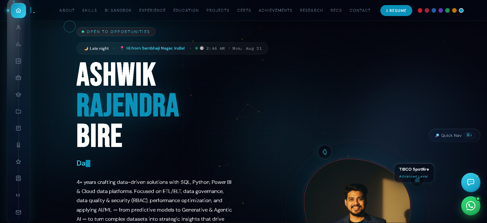
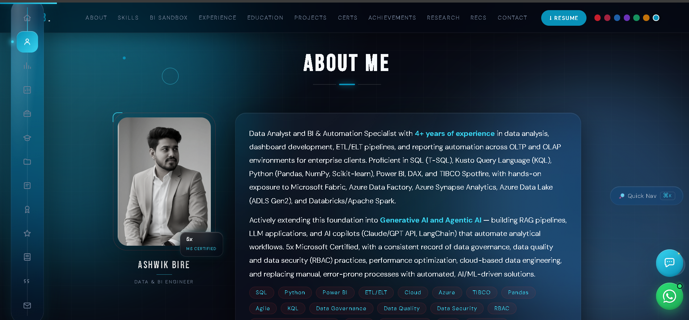
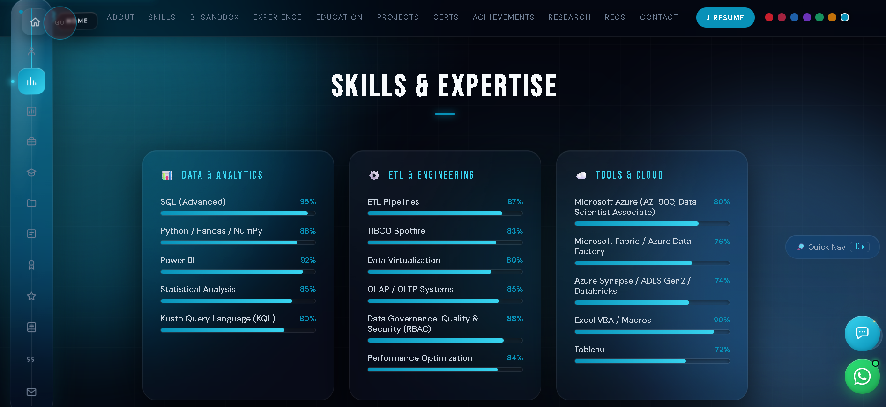
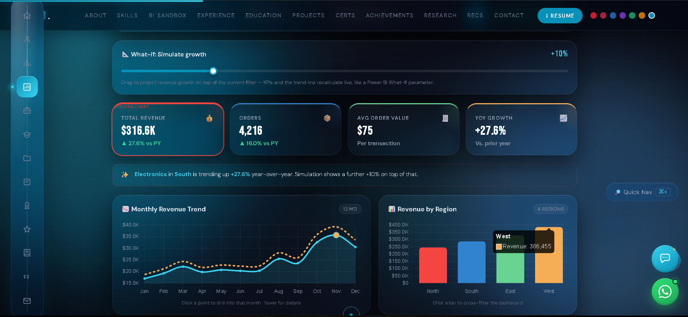
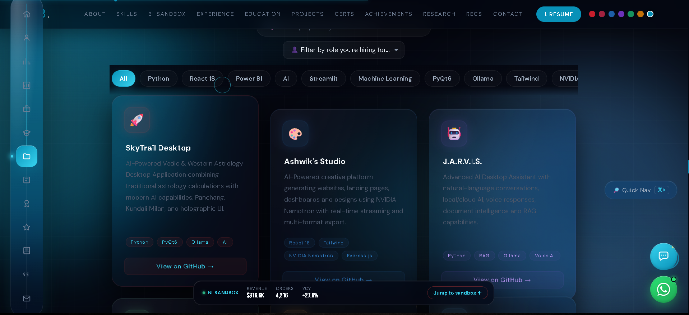
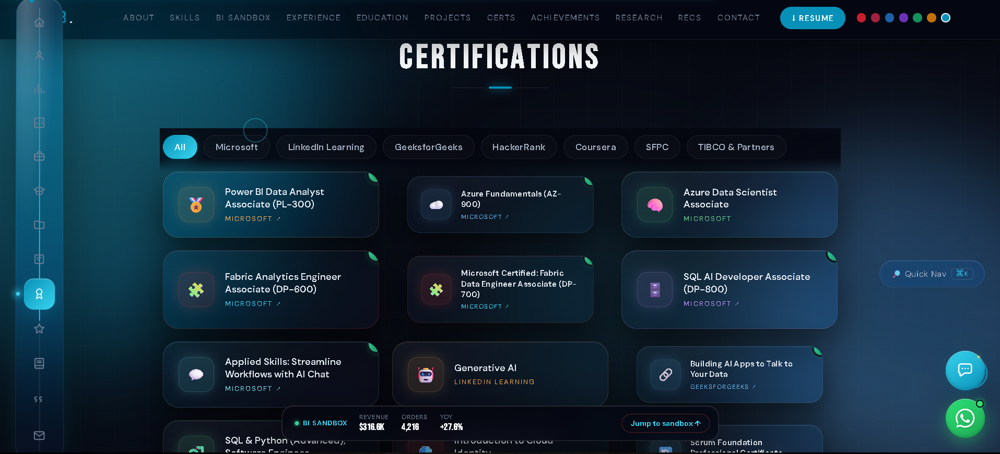
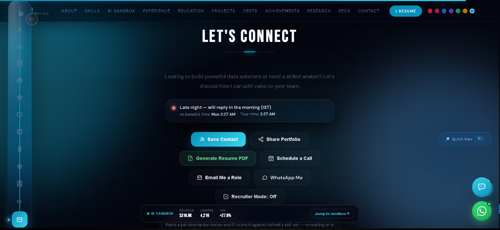

<div align="center">

<!-- ═══════════════════════════════════════════ -->
<!--                  HERO                        -->
<!-- ═══════════════════════════════════════════ -->

# 👋 Hi, I'm Ashwik Bire

### Data Analyst · BI & Automation Specialist · Generative AI Builder

Turning raw, messy data into dashboards, pipelines, and AI copilots that businesses actually act on.

[](https://ashwikbire.github.io/My-Portfolio/)
[](https://linkedin.com/in/ashwik-bire-b2a000186)
[](https://github.com/AshwikBire)
[](mailto:ashwikbire@gmail.com)


</div>

---

## 📖 About

I'm a **Data Analyst and BI & Automation Specialist** with **4+ years of experience** in data analysis, dashboard development, ETL/ELT pipelines, and reporting automation across **OLTP and OLAP** environments for enterprise clients (including FedEx APAC).

I work daily in **SQL (T-SQL), Kusto Query Language (KQL), Python (Pandas, NumPy, Scikit-learn), Power BI, DAX, and TIBCO Spotfire**, with hands-on exposure to **Microsoft Fabric, Azure Data Factory, Azure Synapse Analytics, Azure Data Lake (ADLS Gen2), and Databricks/Apache Spark**.

I'm now actively extending this foundation into **Generative AI and Agentic AI** — building RAG pipelines, LLM applications, and AI copilots (Claude/GPT API, LangChain) that automate analytical workflows. I'm **5× Microsoft Certified**, with a consistent record of data governance, data quality & security (RBAC), performance optimization, cloud-based data engineering, and replacing manual, error-prone processes with automated, AI/ML-driven solutions.

📍 Pune, Maharashtra, India &nbsp;·&nbsp; 📧 ashwikbire@gmail.com &nbsp;·&nbsp; 📱 +91 8459291488 &nbsp;·&nbsp; 🎓 B.E. Electronics & Telecommunication

---

## 🌐 Live Portfolio

<div align="center">

### 👉 **[ashwikbire.github.io/My-Portfolio](https://ashwikbire.github.io/My-Portfolio/)** 👈

*A single-page, glassmorphism-styled, fully interactive portfolio — not just a static resume site.*

</div>

The live site is a **feature-rich, single-file HTML/CSS/JS application** (no build step required) that includes:

- 🪐 **Skills constellation orbit ring** and particle-based hero canvas background
- 💻 **Live BI Sandbox** — an interactive, filterable revenue dashboard with drill-downs, DAX-style KPIs, and a natural-language query box, built entirely in vanilla JS + Chart.js
- 🖥️ **SQL/career terminal widget** with typed animation
- 🤖 **Built-in portfolio chatbot** with quick-question shortcuts
- 📄 **JD Match tool** — paste a job description and get a keyword match score against my resume
- 🧑‍💼 **Recruiter Mode** toggle for a condensed, hiring-manager-focused view
- 🐙 **Live GitHub stats, streak, top languages & contribution heatmap** (via GitHub README Stats / ghchart)
- 📊 **Skills radar / proficiency rings**, animated skill bars, and a data-driven testimonial carousel
- 🕹️ **Command palette (⌘K)**, scroll-resume via `localStorage`, live visitor geolocation & clock badge
- 📱 Fully responsive, swipe-enabled project/certification carousels on mobile
- 📬 **Formspree-powered contact form**, lead-capture modal, WhatsApp float button, and Calendly scheduling
- 📈 A password-gated **analytics dashboard** for visit/lead tracking

---

## 📸 Screenshots

<div align="center">

**Hero**


<br/><br/>

**About Me**


<br/><br/>

**Skills & Expertise**


<br/><br/>

**Live BI Sandbox**


<br/><br/>

**Featured Projects**


<br/><br/>

**Certifications**


<br/><br/>

**Contact**


</div>

> ⚠️ **Still missing:** the Open Graph preview image (`linkedin-preview.png`, 1200×627px) referenced in the page's `<meta>` tags isn't committed yet, so link previews on LinkedIn/Twitter/WhatsApp currently show a broken image. Add that file to the repo root to fix social-share previews. A `mobile.png` (375px viewport) showing responsiveness is also a nice-to-have but not required for this README to render.

---

## 🛠️ Tech Stack & Skills

**Frontend:** Single-file HTML5 / CSS3 (glassmorphism design system) / Vanilla JavaScript · GSAP + ScrollTrigger · Chart.js · jsPDF

**Data & Analytics**

| Skill | Level |
|---|---|
| SQL (Advanced) | 95% |
| Power BI | 92% |
| Python / Pandas / NumPy | 88% |
| Statistical Analysis | 85% |
| Kusto Query Language (KQL) | 80% |

**ETL & Engineering**

| Skill | Level |
|---|---|
| Data Governance, Quality & Security (RBAC) | 88% |
| ETL Pipelines | 87% |
| TIBCO Spotfire | 83% |
| Performance Optimization | 84% |
| OLAP / OLTP Systems | 85% |
| Data Virtualization | 80% |

**Tools & Cloud**

| Skill | Level |
|---|---|
| Excel VBA / Macros | 90% |
| Microsoft Azure (AZ-900, Data Scientist Associate) | 80% |
| Microsoft Fabric / Azure Data Factory | 76% |
| Azure Synapse / ADLS Gen2 / Databricks | 74% |
| Tableau | 72% |

**AI & Agentic Systems**

| Skill | Level |
|---|---|
| Prompt Engineering / AI Copilots | 86% |
| Generative AI / Agentic AI | 85% |
| RAG Pipelines / LangChain | 80% |
| Scikit-learn (ML) | 75% |

**Also:** Data Modeling · Trend Analysis · Forecasting · Dashboard Development · Data Auditing · Power Query · Report Automation · ETL/ELT · REST APIs · UAT/QA Testing

---

## 🚀 Featured Projects

| Project | Description | Stack | Link |
|---|---|---|---|
| 🚀 **SkyTrail Desktop** | AI-powered Vedic & Western astrology desktop app with Panchang, Kundali Milan, and a holographic UI | Python, PyQt6, Ollama, AI | [GitHub ↗](https://github.com/AshwikBire/skytrail-desktop) |
| 🎨 **Ashwik's Studio** | AI-powered creative platform generating websites, dashboards & designs via NVIDIA Nemotron with real-time streaming | React 18, Tailwind, NVIDIA Nemotron, Express.js | [GitHub ↗](https://github.com/AshwikBire/ashwiks-studio) |
| 🤖 **J.A.R.V.I.S.** | Advanced AI desktop assistant — natural-language chat, local/cloud LLM switching, voice, document intelligence & RAG | Python, RAG, Ollama, Voice AI | [GitHub ↗](https://github.com/AshwikBire/jarvis) |
| 📊 **Sales & Business Dashboard** | Power BI-style dashboard analyzing **$11.49M revenue** across **4,800 orders** — executive KPIs, segmentation, YoY growth | Power BI, DAX, Python, Analytics | [Live Demo ↗](https://ashwikbire.github.io/Sales-Business-Performance-Dashboard/) |
| 🔎 **RAG Experiments** | Retrieval-Augmented Generation architectures for natural-language Q&A over structured/unstructured business data | RAG, LangChain, Claude/GPT API | [GitHub ↗](https://github.com/AshwikBire) |
| 📈 **AI Stock Predictor** | ML app forecasting stock price trends from historical market data using regression/classification models | Machine Learning, Regression, Predictive Analytics | [GitHub ↗](https://github.com/AshwikBire/ai-stock-predictor) |
| 🎤 **AI Interview Simulator** | LLM-powered mock interview tool generating role-specific questions and evaluating answers in real time | LLM App Dev, NLP, Prompt Engineering | [GitHub ↗](https://github.com/AshwikBire/ai-interview-simulator) |
| 🧭 **Pravesh Pod — Recruiting Co-Pilot** | AI recruiting pipeline co-pilot on Lemma SDK — automates resume ingestion, JD-fit scoring & interview scheduling | AI, Machine Learning, Lemma SDK, Automation | [GitHub ↗](https://github.com/AshwikBire/pravesh-lemma-pod) |
| 📚 **Power BI Deep Dive** | Self-contained learning platform: Power BI architecture, Power Query, DAX, visualization design, governance & quizzes | Power BI, DAX, Data Analysis, Certification | [Live Demo ↗](https://ashwikbire.github.io/MS-Power-BI-Deep-Dive-Learning/) |
| 📈 **MarketMentor-Pro** | Stock-market learning app with expert guidance, interactive tools and personalized mentorship for traders | Machine Learning, Stock Market, Education, Streamlit | [Live Demo ↗](https://ashwikbire.github.io/MarketMentor-Pro/) |

> **Case study spotlight — Sales & Business Performance Dashboard:** raw transactional data with no unified leadership view was modeled in Power BI using a star schema; DAX measures for YoY growth and KPI cards were paired with Python for pre-cleaning and segmentation logic — shipped as a reusable, drill-down-enabled executive template.

---

## 💼 Experience

| Role | Company | Period |
|---|---|---|
| **Data Analyst** | VDA Infosolutions Pvt. Ltd. | Dec 2023 – May 2025 |
| **Associate Consultant – BI Developer** | Atos Syntel Pvt. Ltd. *(FedEx APAC account)* | Aug 2022 – Aug 2023 |
| **Freelance Mentor / Trainer — Data Analytics & BI** | Max Edutech Solutions & Giotech, Pune | Ongoing |

**Highlights:**
- Automated recurring MIS reports using Python & Excel VBA, **cutting report turnaround time by 60%**
- Built and deployed interactive Power BI & TIBCO Spotfire dashboards for **FedEx APAC** real-time service performance tracking
- Prototyped Generative AI / RAG utilities on internal reporting data for natural-language dashboard querying
- 🏆 **Spot Recognition Award** from the CEO of Atos Syntel (Rakesh Khanna) and from the FedEx APAC client team

## 🎓 Education

| Qualification | Institution | Score | Year |
|---|---|---|---|
| B.E. — Electronics & Telecommunication | P.R. Pote College of Engineering | CGPA: 8.67/10 | 2022 |
| Diploma — Electronics & Telecommunication | Dr. Panjabrao Deshmukh Polytechnic | 75% | 2019 |

---

## 🏅 Certifications

- **Microsoft Certified: Power BI Data Analyst Associate (PL-300)**
- **Microsoft Certified: Azure Fundamentals (AZ-900)**
- **Microsoft Certified: Azure Data Scientist Associate**
- **Microsoft Certified: Fabric Analytics Engineer Associate (DP-600)**
- **Microsoft Certified: Fabric Data Engineer Associate (DP-700)**
- **Microsoft Applied Skills: SQL AI Developer Associate (DP-800)**
- **Microsoft Applied Skills: Streamline Workflows with AI Chat**
- Generative AI — LinkedIn Learning
- Building AI Apps to Talk to Your Data — GeeksforGeeks
- SQL & Python (Advanced), Software Engineer — HackerRank
- Introduction to Cloud Identity — Coursera
- Scrum Foundation Professional Certificate (SFPC)
- TIBCO Spotfire / BI Foundation / Python Programming — TIBCO & Partners

## 🏆 Achievements

- State-wise Winner & **All India Rank 3** — Amrita Business Innovation Challenge (Unstop)
- **National Rank 3** — MangaVerse Hackathon (Unstop · IEEE Vasut WIE)
- **Rank 9**, Certificate of Recognition — Brainwave Blitz-2026, National Innovation Challenge (Unstop)
- **Winner** — Product Matters 6.0 Quiz & Assessment (Unstop, National)
- **Winner** — Cash Me If You Can · Placement Prep Quiz 2026 (Unstop)
- **Winner** — Skillumni Scholarship Aptitude Assessment & AlgoVerse 2026 (Unstop)
- **Top 100 Rank** — 100 Days Coding Challenge (Unstop)

## 📚 Research & Publications

- *IoT Based Fire Control System for Four Wheeler* — IJIRCCE, Vol. 10, Issue 2, Feb 2022
- *Hallucination Drift in Retrieval-Augmented Generation Systems* — independent AI research study
- *Redefining Narratives: A Cross-Disciplinary Study of Memory, Identity, and Collective Storytelling* — Pratyaksh 2026, Philosophy & Psychology track

---

## 📁 Project Structure

```
My-Portfolio/
└── index.html      # Single-file portfolio: all HTML, CSS (glassmorphism
                     # design system) and JavaScript live in this one file.
                     # No build tools or bundler required.
```

**What's inside `index.html`:**
- Inline `<style>` block — CSS custom properties, glassmorphism utility classes, responsive breakpoints, and section-specific styles
- Inline `<script>` — hero canvas particles, skills orbit ring, BI Sandbox logic, chatbot, JD-match scorer, GSAP/ScrollTrigger reveal animations, Chart.js dashboard, jsPDF resume generation, analytics tracking (CountAPI/kvdb.io), and geolocation (ipapi.co)
- Two embedded base64 photos (hero + about) — no external image dependencies for the profile photos
- CDN dependencies loaded at runtime: GSAP, ScrollTrigger, Chart.js, jsPDF, Google Fonts

> **Recommended structure for future iterations** (not yet present in the repo): split into `/assets/css`, `/assets/js`, `/assets/img`, and add the `screenshots/` folder described above, plus a `LICENSE` file.

---

## ⚙️ Local Setup

This is a static, single-file site with **zero build dependencies**.

```bash
# 1. Clone the repository
git clone https://github.com/AshwikBire/My-Portfolio.git
cd My-Portfolio

# 2. Open directly in a browser
open index.html          # macOS
start index.html         # Windows
xdg-open index.html      # Linux

# — or serve it locally for full functionality (recommended, avoids CORS
#   issues with the analytics/geolocation/chart CDN calls) —
python -m http.server 8000
# then visit http://localhost:8000
```

No `npm install`, no bundler, no framework — just open or serve the file. All third-party libraries (GSAP, Chart.js, jsPDF) load from CDN at runtime, so an internet connection is required for full functionality (animations, the BI Sandbox charts, and PDF resume export).

**Deployment:** the live site is hosted via **GitHub Pages** directly from this repository's root.

---

## 🔗 Connect

<div align="center">

[](https://ashwikbire.github.io/My-Portfolio/)
[](https://linkedin.com/in/ashwik-bire-b2a000186)
[](https://github.com/AshwikBire)
[](mailto:ashwikbire@gmail.com)
[](https://calendly.com/ashwikbire/30min)

**Other profiles:** [HackerRank](https://hackerrank.com/ashwikbire) · [CodeChef](https://codechef.com/users/ashwikbire) · [TechGig](https://techgig.com/ashwikbire) · [Unstop](https://unstop.com/u/ashwikbire) · [Fiverr](https://fiverr.com/ashwikbire)

📱 +91 8459291488 &nbsp;·&nbsp; 📍 Pune, Maharashtra, India

</div>

---

<div align="center">

### 💬 Open to Data Analyst, BI Developer & Power BI Developer roles in Pune

**Keywords:** Data Analyst · Business Intelligence Developer · Power BI Developer · SQL Developer · ETL Developer · Data Engineer · Microsoft Fabric · Azure Data Engineer · TIBCO Spotfire Consultant · DAX · Data Governance · Generative AI Engineer · RAG Pipelines · LangChain Developer · Python for Data Analytics · Dashboard Automation · Pune Data Analyst · India BI Consultant

<sub>⭐ If this portfolio or its code structure was useful to you, consider starring the repo.</sub>

</div>
